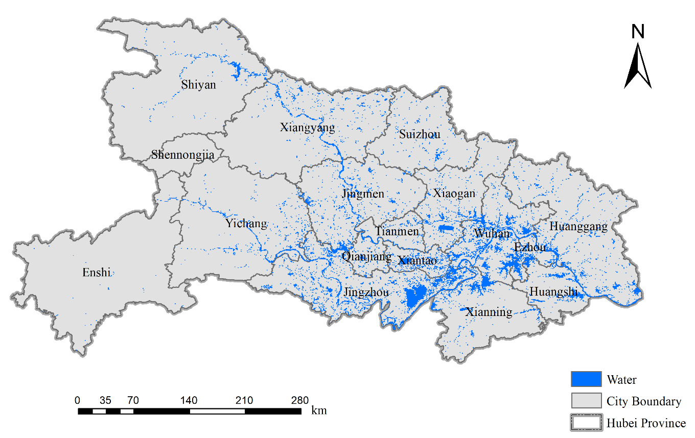

# AQSNet: On the automatic quality assessment of annotated sample data for object extraction from remote sensing imagery

AQSNet is a novel and automatic Annotation Quality aSsessment Network (AQSNet) for remote sensing data, where the goal is to assess the quality of annotated remote sensing samples (e.g., building, waterbody, and other object class datasets). We will release our source code and two constructed AQS datasets when our paper is accepted in the near future.

## Downloading datasets 
*  Hubei Land Cover Satellite DataSet: [HBD4](http://58.48.42.237/luojiaSet/datasets/datasetDetail/77?id=77&taskType=lc)

HBD4 is a big remote sensing dataset, with 1,923,346 tiles of 512 × 512 size. The dataset has an image spatial resolution of 2 m and contains four bands including red, green, blue and near infrared.

     
    Waterbody Resource Distribution in Hubei Province.
     
    Some typical waterbody samples from HBD4.

*  Building Annotation Quality aSsessment Dataset: [BAQS Dataset]()

     
    Visualizations for typical samples with similar IP/CP and different PoP in the BAQS dataset.

*  Waterbody Annotation Quality aSsessment Dataset: [WAQS Dataset]()

     
    Visualizations for typical samples with similar IP/CP and different PoPs on the WAQS dataset.

